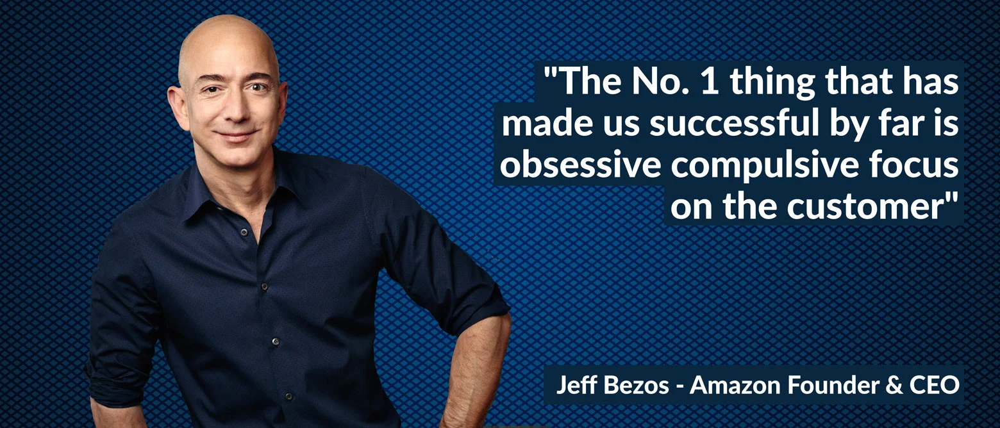

### Describing Customer obsession with S.T.A.R methodology
- Leaders start with the customer and work backwards. 
- They work vigorously to earn and keep customer trust. 
- Although leaders pay attention to competitors, they obsess over customers.

S 
: We notice a gap in the market, this type of food is not only seasonal or trendy, but it might be a whole new market opportunity.
since one new restaurant opend in town and they serving the food in a new odd shaped containers, or they are selling a unique combo like (croissant cookies) you see the demand and you start to think how can you get a share of it.

T
 : Finding out what is the price range customers are willing to pay for this type of food
 What deals are already there in the market customers are responding to

A 
:  First action to be taken is to Lower or raise the price to match the  purchase power in the market, the value of your food will be preceived by the price they pay, if it was too low, they might think the quality is low overall.

* Creating Similar trend and promotions that currently surfacing the market.
* experimenting with trends like tablets on the tables to make the order process easier for the customer 

R
 : You have gained new wave of buyers, that can be turned into loyal repeated customers.
 